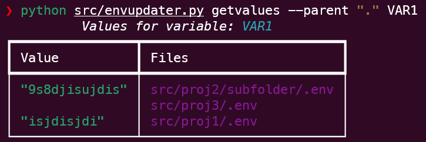

# env-updater

Tiny utility to help manage lots of .env files for my own use.

## Usage:

## Find .env files

```bash
python -m envupdater findenvs --parent "<parentfolder>"
```

## Get values for variable



## Planned features

* Change value of variables in .env files
* Add new variables to .env files
* Remove variables from .env files
* Whatever I find useful
